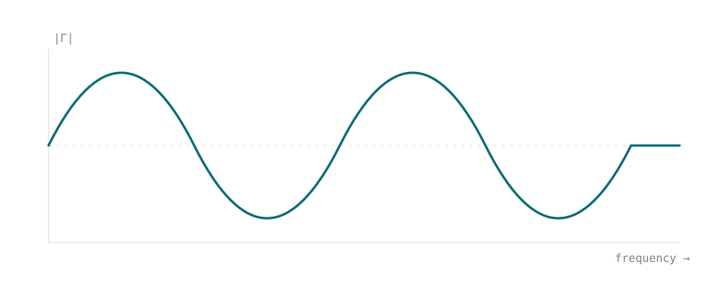

This is a draft, so it only appears when you run `npm run dev`. Open
`src/content/notes/how-to-write-a-post/index.md` beside this page to see how
each part is written.

## Links

Put the words in square brackets and the address in round ones:
[the Curtin Institute of Radio Astronomy](https://www.icrar.org/). Link to
another post on this site with its path, like [Field Notes](/notes/). A bare
address such as https://jumari.com.au turns into a link on its own.

## Photos

Put the picture in the same folder as the post and point at it with `./`.
Text in quotes after the file name becomes the caption:



Leave the quotes off for a picture with no caption. Pictures are resized and
compressed automatically when the site is built.

## Maths

Inline maths goes between single dollar signs: the reflection coefficient is
$\Gamma = (Z_L - Z_0)/(Z_L + Z_0)$, and return loss is
$RL = -20\log_{10}|\Gamma|$ dB. Keep tall things like `\frac` for display
maths, where they have room.

Display maths goes between double dollar signs on their own lines:

$$
\text{VSWR} = \frac{1 + |\Gamma|}{1 - |\Gamma|}
\qquad
AF(\theta) = \sum_{n=0}^{N-1} e^{\,jn(kd\cos\theta + \beta)}
$$

## Code

Inline code uses backticks: `npm run dev`. For a block, use three backticks
and name the language so it gets coloured:

```python
import numpy as np

def gamma(z_load, z0=50):
    """Reflection coefficient for a load impedance."""
    return (z_load - z0) / (z_load + z0)

print(abs(gamma(35 - 30j)))
```

```c
// Set the attenuator over SPI
void set_atten(uint8_t steps) {
    spi_write(ATTEN_CS, steps & 0x3F);
}
```

## Quotes, lists and tables

> A blockquote gets a teal rule down the left, not italics.

- Bullet lists use a dash
- Numbered lists use `1.`

| Parameter  | Value      |
|------------|------------|
| Frequency  | 2.45 GHz   |
| Impedance  | 50 Ω       |
| Array size | 16 elements |

***

Three asterisks on their own line make the centred section break above.
Footnotes work too.[^1]

[^1]: Like this. Write `[^1]` where the marker goes and `[^1]: text` anywhere below.
